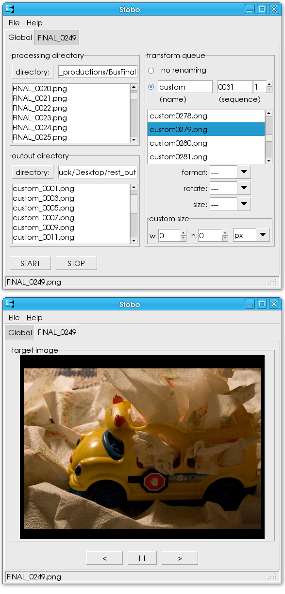

[meta:title]: <> (Big UPDATE)
[meta:type]: <> (blog)
[meta:author]: <> (Bumblehead)
[meta:date]: <> (2009.05.05)
[meta:href]: <> (/blog/big-update)
[meta:tags]: <> (video,photography,software,art)
[meta:comments]: <> (off)

### Big UPDATE!

 * 
 * 
 * 
 * 

Today I'm releasing Stobo-1.0

The 1.0'ness of this release signifies my opinion that Stobo is fully functional software. It has not been idiot-proofed yet, but that'll've happened in the 2.0 release.

Here's what Stobo is. It's the missing stop-motion link in the free software chain. Stobo will 'listen' to a directory and will recognize image files if any appear in the directory. All image files in the directory are automatically copied, formatted, renamed, and saved to another location (for example, a network-mounted directory).

It's free. it's cross-platform. It's camera-agnostic. It's easy to use. If you don't see the utility of this, you are either a) not a stopmotion animator, b) using the wrong work-flow or c) you are person who likes spending money (don't be ashamed).

If you are 'c)', I still recommend that you take a look at Stobo. If you use Stobo, you'll be able to access the developer, me, for suggestions or help at any time. Note: I do love you, but don't abuse that :).
