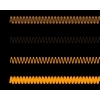
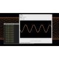
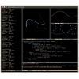
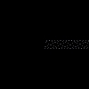

[meta:title]: <> (making waves)
[meta:type]: <> (blog)
[meta:author]: <> (Bumblehead)
[meta:date]: <> (2010.06.04)
[meta:href]: <> (/blog/making-waves)
[meta:tags]: <> (video,misc,professional,software,2d,art)
[meta:comments]: <> (off)

### Making Waves

 * [](support/img/full/sine-evolution.jpg)
 * [](support/img/full/render.jpg)
 * [](support/img/full/emacs-screenshot.jpg)
 * [](support/img/full/testing.jpg)  

I finished a sinewave animation and [there's a demonstration page][0] that displays various sinewave videos made during production. The results are surprisingly dynamic. The fun part of this project involved writing a Common Lisp program for generating the sinewaves and this required a few things in addition to writing a sinewave function. There are functions for drawing circles and connecting lines. There's a class for generating exponential curves...

It'll be appearing in a video.
Something To Come Undone, dir. Anna Chiaretta Lavatelli, 2010

I only corresponded with Anna through email, but I want to give her a positive review. She was on schedule, productive, relaxed and reasonable and just pleasant to work with. How many people can 'pull things off like that? Not many people can.

Here are two tiny code pieces from sinewave.lisp. 'Live on, Common Lisp!  

```lisp
(defmethod  coords-to-canvas (coords rgba (canvas image-canvas))
  (mapcar #'(lambda (xy)
              (pixel-to-canvas xy rgba canvas))
          coords))
(defmacro when-inside (frame bgn end &body body)
  `(when (and (>= ,frame ,bgn)
              (<= ,frame ,end))
     ,@body)) 
```

[0]: www.google.com "sinewave demo"